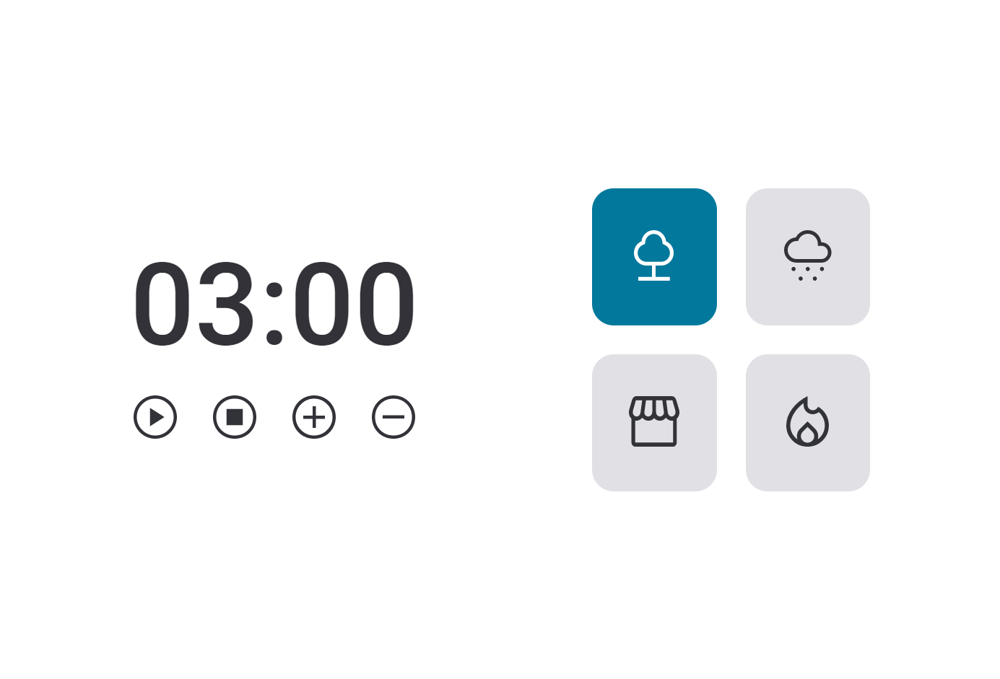

# Stage 5 - Focus Timer Desafio

>Curso Explorer

Projeto construído no curso Explorer da Rocketseat. 
Trata-se de um cronometro estilo pomodoro, com botões para escolher uma música. Temos também a opção de alternar entre o modo Light e modo Dark clicando no botão no canto superior da tela.

[ 🔗 Clique aqui para acessar](https://ricardojcosta.github.io/FocusTime_Desafio)

## ⚒ Tecnologias

  - HTML 
  - CSS 
  - JS 
  - Git e Github

## ✉ Contato

ricardoredes2006@gmail.com